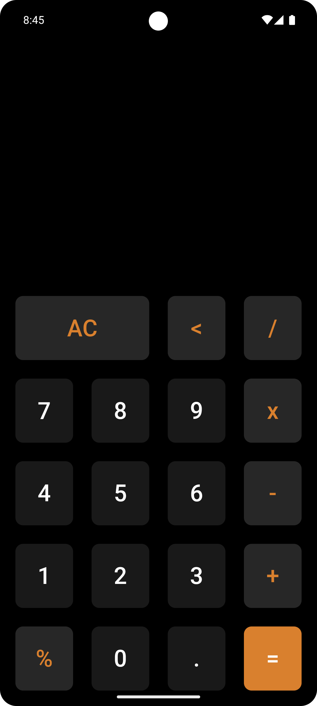

# 📱 Flutter Calculator App  

A **simple yet powerful calculator app** built with **Flutter**! 🚀 This app supports basic arithmetic operations with a clean and responsive UI.  

## ✨ Features  
✔️ **Basic Arithmetic Operations** (Addition, Subtraction, Multiplication, Division, Percentage)  
✔️ **Clear & Backspace Functionality**  
✔️ **Real-time Expression Evaluation** using `math_expressions` 📊  
✔️ **Smooth UI & Responsive Design**  
✔️ **Optimized for Mobile Screens** 📱  

## 🖥️ Screenshots  


## 🚀 Getting Started  
### 1️⃣ Clone the Repository  
```bash
git clone https://github.com/your-username/flutter-calculator.git
cd flutter-calculator
```
### 2️⃣ Install Dependencies  
```bash
flutter pub get
```
### 3️⃣ Run the App  
```bash
flutter run
```

## 🛠️ Technologies Used  
- **Flutter** (Dart) 💙  
- **math_expressions** package for evaluation  
- **Material Design** for UI  

## 🎯 Future Improvements  
🔹 History of calculations  
🔹 Scientific calculator mode  
🔹 Dark/Light mode toggle  

<!-- ## ❤️ Contribution  
Feel free to fork, contribute, and make this calculator even better! PRs are welcome.  

## 📜 License  
This project is **MIT licensed**.  

---

Let me know if you want any modifications! 🚀🔥 -->